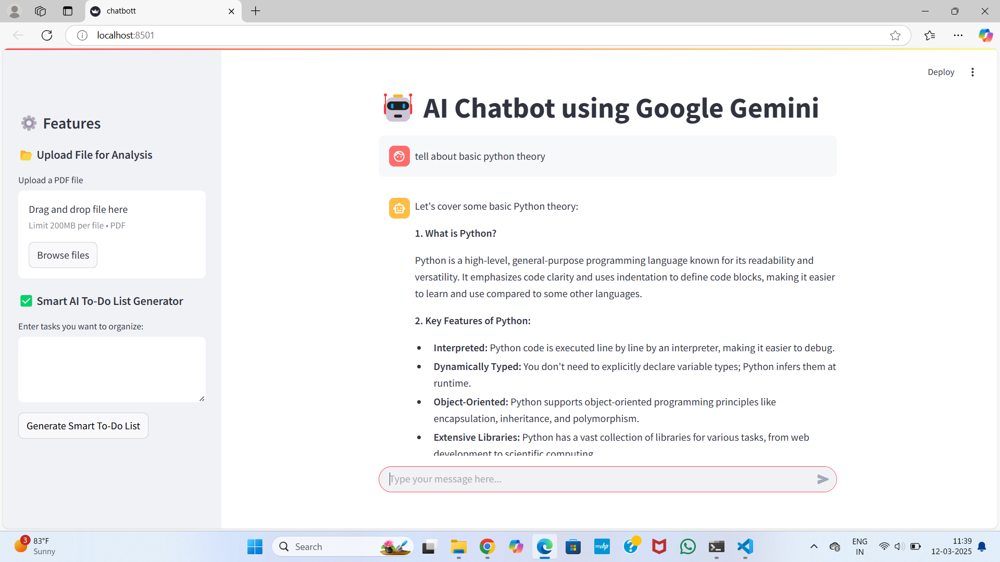
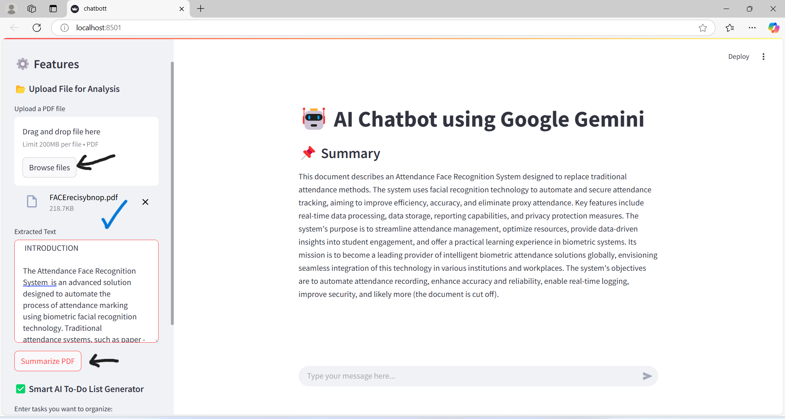
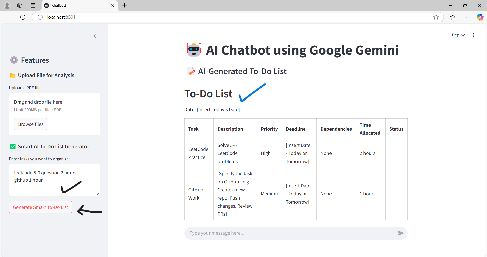

# **Chatbot**
 *A Streamlit-powered AI chatbot using Google Gemini API with features like a Smart To-Do List and PDF Summarization.*
---
# AI Chatbot with Google Gemini API

A **Streamlit-powered AI chatbot** leveraging **Google Gemini API** for intelligent conversations, PDF summarization, and AI-powered task management. Built with a sleek **dark-mode UI**, this project enhances productivity and user experience.

---
# Output-Screenshots
<p align="center">
  
  
  
</p>

---

## **🚀 Features**

### 🔹 **AI Chatbot (Google Gemini Integration)**

- Real-time conversational AI using **Google Gemini API**.
- Maintains **chat history** for seamless interactions.

### 🔹 **PDF Summarization**

- Upload and process **PDF files**.
- Extracts key content and generates **AI-powered summaries**.

### 🔹 **Smart AI To-Do List Generator**

- Organizes tasks into a **structured to-do list with priorities and deadlines**.
- AI-generated insights help in **task management**.

---


## **🛠️ Tech Stack**

- **Python** – Core programming language.
- **Streamlit** – Interactive UI framework.
- **Google Gemini API** – AI-driven text processing and response generation.
- **PyPDF2** – Extracts and processes text from PDFs.
- **OS & Environment Variables** – Secure API key handling.

---

## **📌 Installation & Setup**

### **1️⃣ Clone the Repository**

```bash
git clone https://github.com/GangaEbagewadi/chatbot
cd chatbott
```

### **2️⃣ Install Dependencies**

Ensure Python is installed, then run:

```bash
pip install -r requirements.txt
```

### **3️⃣ Set Up API Key**

Create a `.env` file and add your **Google Gemini API Key**:

```bash
GOOGLE_API_KEY=your_api_key_here
```

Alternatively, set the environment variable manually:

```bash
$env:GOOGLE_API_KEY="your_api_key_here"  # Windows PowerShell
export GOOGLE_API_KEY="your_api_key_here"  # Linux/macOS
```

### **4️⃣ Run the Application**

```bash
streamlit run app.py
```

---

## **📝 Usage Guide**

### ✅ **AI Chatbot**

- Type a message in the chat input field.
- AI generates smart responses using **Google Gemini API**.

### 📂 **PDF Summarization**

- Upload a **PDF document** via the sidebar.
- AI extracts key content and provides a **concise summary**.

### 📌 **AI-Powered To-Do List**

- Enter tasks in the **text area**.
- AI organizes tasks with **priorities and deadlines**.

---

📜 License

This project is open-source. Feel free to modify and improve it! 🎉

